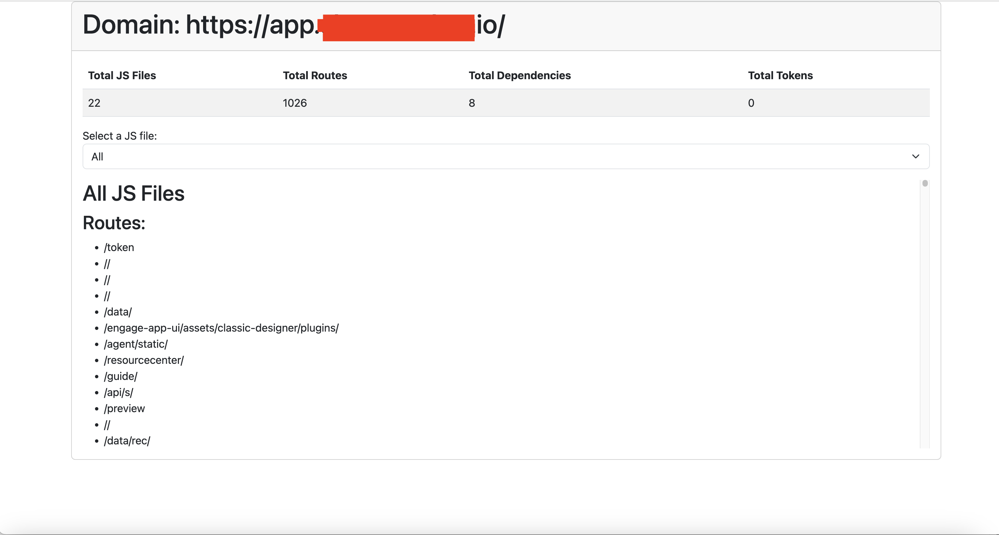

# Front parser

Finds routes, dependencies and tokens in your front-end and generate an HTML report.



## Features

- Fetches page source code using Chrome Developer Protocol (CDP) via the ```chromedp``` library
- Parse all linked JavaScript files
- Find routes, dependencies, and tokens in each JS file
- Generates an HTML report

## Prerequisites

- Go 1.17 or above
- chromedp
- jwt-go

## How to Use

- Build

```bash
go build front-parser.go
```

- Use

```bash
./front-parser https://app.example.com/
```

  ## Usage Example

  
